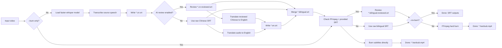
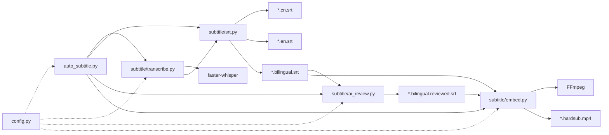

# Subtitle Pipeline

Standalone subtitle pipeline built with `faster-whisper` and `FFmpeg`.

It supports:
- Chinese speech recognition
- AI-reviewed Chinese transcript cleanup
- English translation
- Chinese SRT / English SRT / bilingual SRT generation
- Optional AI-based Chinese review and bilingual subtitle review (`codex` / OpenAI Official / SiliconFlow)
- Optional hard-sub burn-in
- Simplified Chinese aliases (`zh-CN`, `zh-Hans`, `cn`, `chinese`)

Chinese docs:
- Quick start: [QUICKSTART.md](QUICKSTART.md)
- [README.zh-CN.md](README.zh-CN.md)
- [DEPLOY.zh-CN.md](DEPLOY.zh-CN.md)
- [CONTRIBUTING.zh-CN.md](CONTRIBUTING.zh-CN.md)
- [CODE_OF_CONDUCT.zh-CN.md](CODE_OF_CONDUCT.zh-CN.md)
- [SECURITY.zh-CN.md](SECURITY.zh-CN.md)
- [RELEASE.zh-CN.md](RELEASE.zh-CN.md)
- [RELEASE_NOTES_TEMPLATE.zh-CN.md](RELEASE_NOTES_TEMPLATE.zh-CN.md)

## 1. One-Click Deploy

### Windows
```bat
install.bat
```

### macOS / Linux
```bash
bash setup.sh
```

Both scripts will:
1. Create `.venv`
2. Install Python dependencies from `requirements.txt`
3. Check FFmpeg
4. Print runnable commands

On Windows, `setup.ps1` will prefer project-level `mise` Python (when `mise` is available and `.mise.toml` exists), then fall back to `py` / `python`.

For more details, see [DEPLOY.md](DEPLOY.md).

## 2. Quick Start

### Option A: helper script

Windows:
```bat
run.bat input.mp4
run.bat input.mp4 --no-burn
```

macOS / Linux:
```bash
bash run.sh input.mp4
bash run.sh input.mp4 --no-burn
```

### Option B: direct Python command
```bash
python auto_subtitle.py input.mp4
python auto_subtitle.py input.mp4 --model medium --no-burn
python auto_subtitle.py input.mp4 --model-source auto --mirror-endpoint https://hf-mirror.com
python auto_subtitle.py input.mp4 --model-source local --model-dir ./models --no-burn
python auto_subtitle.py input.mp4 --source-language zh-CN
python auto_subtitle.py input.mp4 --source-language zh-CN --zh-script simplified
python auto_subtitle.py input.mp4 --ai-review on --ai-review-provider codex
python auto_subtitle.py input.mp4 --ai-review on --ai-review-provider openai --ai-review-model gpt-4.1-mini
python auto_subtitle.py input.mp4 --ai-review on --ai-review-provider siliconflow --ai-review-model Pro/MiniMaxAI/MiniMax-M2.5
python auto_subtitle.py input.mp4 --burn-only output/input.bilingual.srt
```

## 3. CLI Usage

```text
python auto_subtitle.py <video> [--model MODEL] [--model-source MODE] [--model-dir DIR] [--mirror-endpoint URL] [--source-language LANG] [--zh-script SCRIPT] [--output OUTPUT] [--ai-review {auto,on,off}] [--ai-review-provider {codex,openai,siliconflow}] [--ai-review-model MODEL] [--ai-review-base-url URL] [--no-burn] [--burn-only SRT]
```

Key options:
- `--model`: whisper model size (`tiny/base/small/medium/large-v3`)
- `--model-source`: model source strategy (`auto/official/mirror/local`)
- `--model-dir`: model directory (local model path or download cache directory)
- `--mirror-endpoint`: mirror endpoint for `mirror`/`auto` mode (for example `https://hf-mirror.com`)
- `--source-language`: input speech language (default: `zh`, supports `zh-CN`, `zh-Hans`, `cn`, `chinese`)
- `--zh-script`: Chinese subtitle script (`simplified`/`traditional`/`raw`, default: `simplified`)
- `--output`: output folder (default: `output`)
- `--ai-review`: enable/disable AI subtitle review (`auto` skips safely if unavailable, `on` enables the AI steps, `off` disables)
- `--ai-review-provider`: choose review backend (`codex` / `openai` / `siliconflow`)
- `--ai-review-model`: optional model override for subtitle review/translation; required for `openai` / `siliconflow` unless `AI_REVIEW_MODEL` is set
- `--ai-review-base-url`: optional OpenAI-compatible base URL override
- `--no-burn`: only generate SRT files
- `--burn-only`: skip ASR/translation and burn with existing SRT

Environment overrides:
- `AI_REVIEW_MODE`
- `AI_REVIEW_PROVIDER`
- `AI_REVIEW_MODEL`
- `AI_REVIEW_BASE_URL`
- `OPENAI_API_KEY`
- `SILICONFLOW_API_KEY`
- `AI_REVIEW_API_KEY` (generic override)

Local env files loaded automatically before CLI parsing:
- `.env.ai-review.local`
- `.env.ai-review.<provider>.local`

Shell env vars take precedence over values in those files.

## 4. Outputs

For input `input.mp4` (default output dir: `output/`):
- `output/input.cn.srt`
- `output/input.cn.reviewed.srt` (when Chinese AI review succeeds)
- `output/input.en.srt`
- `output/input.bilingual.srt`
- `output/input.bilingual.reviewed.srt` (when AI review succeeds)
- `output/input.*.mp4` (hard-sub output, if burn is enabled)

## 5. Project Structure

```text
subtitle-pipeline/
  auto_subtitle.py         # CLI entrypoint
  config.py                # model/device/subtitle-style config
  requirements.txt
  install.bat              # one-click setup (Windows)
  setup.ps1                # one-click setup (Windows PowerShell)
  setup.sh                 # one-click setup (macOS/Linux)
  run.bat                  # run helper (Windows)
  run.sh                   # run helper (macOS/Linux)
  subtitle/
    transcribe.py          # ASR + Whisper audio translation
    srt.py                 # SRT writer + bilingual merge
    ai_review.py           # AI-based Chinese review, text translation, bilingual review
    embed.py               # FFmpeg hard-burn and mux
```

## 6. Reference Diagrams

Editable draw.io sources:
- [docs/diagrams/pipeline-flow.drawio](docs/diagrams/pipeline-flow.drawio)
- [docs/diagrams/system-architecture.drawio](docs/diagrams/system-architecture.drawio)
- [docs/diagrams/README.md](docs/diagrams/README.md) (how to add more diagrams)

### Execution Flow



### Module Architecture



## 7. Requirements

- Python 3.10+
- Optional: `mise` (recommended for consistent project Python version)
- FFmpeg in `PATH`
- Optional NVIDIA GPU for faster inference

If you use `mise`, run in project root:
```bash
mise trust .mise.toml
mise install
```

## 8. Troubleshooting

### FFmpeg not found
Install FFmpeg and ensure `ffmpeg` is in your shell `PATH`.

### Slow on CPU
Use a smaller model (`--model small`), or run with GPU.

### First run is slow
`faster-whisper` downloads model files on first use.

### AI review is skipped or partially degraded
`--ai-review auto` falls back safely when the selected provider is unavailable or review fails.

Provider setup:
- `codex`: ensure `codex --version` and `codex login` both work
- `openai`: set `OPENAI_API_KEY` and pass `--ai-review-model`
- `siliconflow`: set `SILICONFLOW_API_KEY` and pass `--ai-review-model`

Current AI flow:
- review Chinese transcript first
- translate English from the reviewed Chinese text
- if English text translation is invalid, retry with validation feedback
- if it still fails, fall back to Whisper audio translation
- optionally review the merged bilingual subtitles

### Switch provider via environment variables
Recommended setup:

Create `.env.ai-review.local`:

```env
AI_REVIEW_MODE=on
AI_REVIEW_PROVIDER=siliconflow
```

Create `.env.ai-review.siliconflow.local`:

```env
AI_REVIEW_MODEL=Pro/MiniMaxAI/MiniMax-M2.5
AI_REVIEW_BASE_URL=https://api.siliconflow.cn/v1
SILICONFLOW_API_KEY=your_key_here
```

Then run:

```powershell
run.bat "input.mp4" --no-burn
```

To switch provider temporarily in the current shell:

```powershell
$env:AI_REVIEW_PROVIDER = 'openai'
$env:AI_REVIEW_MODEL = 'gpt-4.1-mini'
$env:OPENAI_API_KEY = 'your_key_here'
run.bat "input.mp4" --no-burn
```

### Reuse existing cc-switch credentials
Optional path:

```powershell
.\scripts\use_ai_review_profile.ps1 openai
run.bat "input.mp4" --no-burn
```

or:

```powershell
.\scripts\use_ai_review_profile.ps1 siliconflow
run.bat "input.mp4" --no-burn
```

If you want the raw env file, you can still extract project-specific env vars from local `cc-switch` config:

```powershell
.\.venv\Scripts\python.exe scripts\export_ai_review_env.py --provider openai --format powershell > .tmp\openai-ai-review.ps1
.\.venv\Scripts\python.exe scripts\export_ai_review_env.py --provider siliconflow --format powershell > .tmp\siliconflow-ai-review.ps1
```

Load one of them in PowerShell:

```powershell
. .\.tmp\openai-ai-review.ps1
run.bat "input.mp4" --no-burn
```

The extractor reads `~/.cc-switch/cc-switch.db` and emits env vars for this project only.
Template file: `.env.ai-review.example`

### First run fails with timeout / model download error
`faster-whisper` downloads model files from Hugging Face. Ensure your network/proxy can reach Hugging Face, then retry.
You can validate the full pipeline with a smaller model first:
```bash
python auto_subtitle.py input.mp4 --model tiny --no-burn
```

### Recommended for users in mainland China
Use mirror mode, or provide local models:
```bash
python auto_subtitle.py input.mp4 --model tiny --model-source auto --mirror-endpoint https://hf-mirror.com --no-burn
python auto_subtitle.py input.mp4 --model-source local --model-dir ./models --no-burn
```

## 9. License

This project is released under the MIT License. See [LICENSE](LICENSE).

## 10. Open Source Collaboration

- Contribution guide: [CONTRIBUTING.md](CONTRIBUTING.md)
- Code of conduct: [CODE_OF_CONDUCT.md](CODE_OF_CONDUCT.md)
- Security policy: [SECURITY.md](SECURITY.md)
- Release process: [RELEASE.md](RELEASE.md)
