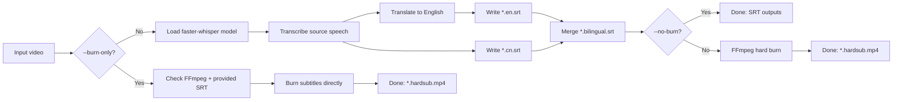
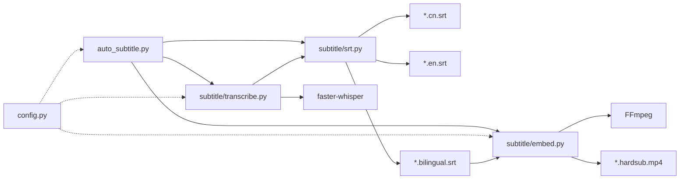

# Subtitle Pipeline

Standalone subtitle pipeline built with `faster-whisper` and `FFmpeg`.

It supports:
- Chinese speech recognition
- English translation
- Chinese SRT / English SRT / bilingual SRT generation
- Optional hard-sub burn-in
- Simplified Chinese aliases (`zh-CN`, `zh-Hans`, `cn`, `chinese`)

Chinese docs:
- [README.zh-CN.md](README.zh-CN.md)
- [DEPLOY.zh-CN.md](DEPLOY.zh-CN.md)
- [CONTRIBUTING.zh-CN.md](CONTRIBUTING.zh-CN.md)
- [CODE_OF_CONDUCT.zh-CN.md](CODE_OF_CONDUCT.zh-CN.md)
- [SECURITY.zh-CN.md](SECURITY.zh-CN.md)
- [RELEASE.zh-CN.md](RELEASE.zh-CN.md)
- [RELEASE_NOTES_TEMPLATE.zh-CN.md](RELEASE_NOTES_TEMPLATE.zh-CN.md)

## 1. One-Click Deploy

### Windows
```bat
install.bat
```

### macOS / Linux
```bash
bash setup.sh
```

Both scripts will:
1. Create `.venv`
2. Install Python dependencies from `requirements.txt`
3. Check FFmpeg
4. Print runnable commands

For more details, see [DEPLOY.md](DEPLOY.md).

## 2. Quick Start

### Option A: helper script

Windows:
```bat
run.bat input.mp4
run.bat input.mp4 --no-burn
```

macOS / Linux:
```bash
bash run.sh input.mp4
bash run.sh input.mp4 --no-burn
```

### Option B: direct Python command
```bash
python auto_subtitle.py input.mp4
python auto_subtitle.py input.mp4 --model medium --no-burn
python auto_subtitle.py input.mp4 --source-language zh-CN
python auto_subtitle.py input.mp4 --burn-only output/input.bilingual.srt
```

## 3. CLI Usage

```text
python auto_subtitle.py <video> [--model MODEL] [--source-language LANG] [--output OUTPUT] [--no-burn] [--burn-only SRT]
```

Key options:
- `--model`: whisper model size (`tiny/base/small/medium/large-v3`)
- `--source-language`: input speech language (default: `zh`, supports `zh-CN`, `zh-Hans`, `cn`, `chinese`)
- `--output`: output folder (default: `output`)
- `--no-burn`: only generate SRT files
- `--burn-only`: skip ASR/translation and burn with existing SRT

## 4. Outputs

For input `input.mp4` (default output dir: `output/`):
- `output/input.cn.srt`
- `output/input.en.srt`
- `output/input.bilingual.srt`
- `output/input.*.mp4` (hard-sub output, if burn is enabled)

## 5. Project Structure

```text
subtitle-pipeline/
  auto_subtitle.py         # CLI entrypoint
  config.py                # model/device/subtitle-style config
  requirements.txt
  install.bat              # one-click setup (Windows)
  setup.ps1                # one-click setup (Windows PowerShell)
  setup.sh                 # one-click setup (macOS/Linux)
  run.bat                  # run helper (Windows)
  run.sh                   # run helper (macOS/Linux)
  subtitle/
    transcribe.py          # ASR + translation
    srt.py                 # SRT writer + bilingual merge
    embed.py               # FFmpeg hard-burn and mux
```

## 6. Reference Diagrams

Editable draw.io sources:
- [docs/diagrams/pipeline-flow.drawio](docs/diagrams/pipeline-flow.drawio)
- [docs/diagrams/system-architecture.drawio](docs/diagrams/system-architecture.drawio)
- [docs/diagrams/README.md](docs/diagrams/README.md) (how to add more diagrams)

### Execution Flow



### Module Architecture



## 7. Requirements

- Python 3.10+
- FFmpeg in `PATH`
- Optional NVIDIA GPU for faster inference

## 8. Troubleshooting

### FFmpeg not found
Install FFmpeg and ensure `ffmpeg` is in your shell `PATH`.

### Slow on CPU
Use a smaller model (`--model small`), or run with GPU.

### First run is slow
`faster-whisper` downloads model files on first use.

## 9. License

This project is released under the MIT License. See [LICENSE](LICENSE).

## 10. Open Source Collaboration

- Contribution guide: [CONTRIBUTING.md](CONTRIBUTING.md)
- Code of conduct: [CODE_OF_CONDUCT.md](CODE_OF_CONDUCT.md)
- Security policy: [SECURITY.md](SECURITY.md)
- Release process: [RELEASE.md](RELEASE.md)
