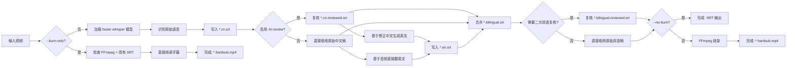

# Subtitle Pipeline（简体中文）

英文版：[README.md](README.md)
快速使用（推荐先看）：[QUICKSTART.zh-CN.md](QUICKSTART.zh-CN.md)

基于 `faster-whisper` 和 `FFmpeg` 的独立字幕流水线。

支持能力：
- 中文语音识别
- AI 清洗中文字幕文本
- 英文翻译
- 生成中文字幕 / 英文字幕 / 双语字幕
- 可选的中文字幕 AI 复核与双语字幕 AI 复核（`codex` / OpenAI Official / 硅基流动）
- 可选硬字幕烧录
- 支持简体中文别名（`zh-CN`、`zh-Hans`、`cn`、`chinese`）

## 1. 一键部署

### Windows
```bat
install.bat
```

### macOS / Linux
```bash
bash setup.sh
```

两个脚本都会执行：
1. 创建 `.venv`
2. 从 `requirements.txt` 安装依赖
3. 检查 FFmpeg
4. 输出可直接运行的命令

在 Windows 上，`setup.ps1` 会优先使用项目级 `mise` Python（当存在 `mise` 与 `.mise.toml`），然后回退到 `py` / `python`。

更多细节见 [DEPLOY.zh-CN.md](DEPLOY.zh-CN.md)。

## 2. 快速开始

### 方式 A：辅助脚本

Windows：
```bat
run.bat input.mp4
run.bat input.mp4 --no-burn
```

macOS / Linux：
```bash
bash run.sh input.mp4
bash run.sh input.mp4 --no-burn
```

### 方式 B：直接调用 Python
```bash
python auto_subtitle.py input.mp4
python auto_subtitle.py input.mp4 --model medium --no-burn
python auto_subtitle.py input.mp4 --model-source auto --mirror-endpoint https://hf-mirror.com
python auto_subtitle.py input.mp4 --model-source local --model-dir ./models --no-burn
python auto_subtitle.py input.mp4 --source-language zh-CN
python auto_subtitle.py input.mp4 --source-language zh-CN --zh-script simplified
python auto_subtitle.py input.mp4 --ai-review on --ai-review-provider codex
python auto_subtitle.py input.mp4 --ai-review on --ai-review-provider openai --ai-review-model gpt-4.1-mini
python auto_subtitle.py input.mp4 --ai-review on --ai-review-provider siliconflow --ai-review-model Pro/MiniMaxAI/MiniMax-M2.5
python auto_subtitle.py input.mp4 --burn-only output/input.bilingual.srt
```

## 3. CLI 用法

```text
python auto_subtitle.py <video> [--model MODEL] [--model-source MODE] [--model-dir DIR] [--mirror-endpoint URL] [--source-language LANG] [--zh-script SCRIPT] [--output OUTPUT] [--ai-review {auto,on,off}] [--ai-review-provider {codex,openai,siliconflow}] [--ai-review-model MODEL] [--ai-review-base-url URL] [--no-burn] [--burn-only SRT]
```

关键参数：
- `--model`：whisper 模型大小（`tiny/base/small/medium/large-v3`）
- `--model-source`：模型来源策略（`auto/official/mirror/local`）
- `--model-dir`：模型目录（可作为本地模型目录或下载缓存目录）
- `--mirror-endpoint`：`mirror/auto` 模式下的镜像端点（如 `https://hf-mirror.com`）
- `--source-language`：输入语音语言（默认 `zh`，支持 `zh-CN`、`zh-Hans`、`cn`、`chinese`）
- `--zh-script`：中文字幕字形（`simplified`/`traditional`/`raw`，默认 `simplified`）
- `--output`：输出目录（默认 `output`）
- `--ai-review`：是否启用 AI 字幕复核（`auto` 自动跳过失败场景，`on` 启用 AI 流程，`off` 关闭）
- `--ai-review-provider`：选择复核后端（`codex` / `openai` / `siliconflow`）
- `--ai-review-model`：指定字幕复核/翻译模型；对 `openai` / `siliconflow` 基本属于必填，除非设置了 `AI_REVIEW_MODEL`
- `--ai-review-base-url`：可选，自定义 OpenAI 兼容接口地址
- `--no-burn`：只生成 SRT，不烧录视频
- `--burn-only`：跳过识别/翻译，直接使用现有 SRT 烧录

环境变量覆盖：
- `AI_REVIEW_MODE`
- `AI_REVIEW_PROVIDER`
- `AI_REVIEW_MODEL`
- `AI_REVIEW_BASE_URL`
- `OPENAI_API_KEY`
- `SILICONFLOW_API_KEY`
- `AI_REVIEW_API_KEY`（通用覆盖，谨慎使用）

CLI 解析前会自动加载本地 env 文件：
- `.env.ai-review.local`
- `.env.ai-review.<provider>.local`

如果 Shell 里已经设置了同名环境变量，Shell 值优先。

## 4. 输出文件

输入文件为 `input.mp4` 时（默认输出目录 `output/`）：
- `output/input.cn.srt`
- `output/input.cn.reviewed.srt`（AI 中文复核成功时生成）
- `output/input.en.srt`
- `output/input.bilingual.srt`
- `output/input.bilingual.reviewed.srt`（AI 复核成功时生成）
- `output/input.*.mp4`（启用烧录时）

## 5. 项目结构

```text
subtitle-pipeline/
  auto_subtitle.py         # CLI 入口
  config.py                # 模型/设备/字幕样式配置
  requirements.txt
  install.bat              # 一键安装（Windows）
  setup.ps1                # 一键安装（Windows PowerShell）
  setup.sh                 # 一键安装（macOS/Linux）
  run.bat                  # 运行辅助脚本（Windows）
  run.sh                   # 运行辅助脚本（macOS/Linux）
  subtitle/
    transcribe.py          # 语音识别 + Whisper 音频翻译
    srt.py                 # SRT 写入 + 双语合并
    ai_review.py           # 中文字幕复核、文本翻译、双语复核
    embed.py               # FFmpeg 烧录与封装
```

## 6. 参考图

可编辑 draw.io 源文件：
- [docs/diagrams/pipeline-flow.drawio](docs/diagrams/pipeline-flow.drawio)
- [docs/diagrams/system-architecture.drawio](docs/diagrams/system-architecture.drawio)
- [docs/diagrams/README.md](docs/diagrams/README.md)（新增图示说明）

### 执行流程



## 7. 环境要求

- Python 3.10+
- 可选：`mise`（推荐用于统一项目 Python 版本）
- `PATH` 中可用的 FFmpeg
- 可选：NVIDIA GPU（加速推理）

如果你使用 `mise`，在项目根目录执行：
```bash
mise trust .mise.toml
mise install
```

## 8. 常见问题

### 找不到 FFmpeg
安装 FFmpeg，并确保 `ffmpeg` 命令在当前 Shell 的 `PATH` 中可用。

### CPU 运行太慢
改用较小模型（如 `--model small`），或使用 GPU 运行。

### 首次运行较慢
`faster-whisper` 首次运行会下载模型文件。

### AI 复核被跳过或部分降级
`--ai-review auto` 在所选 provider 不可用或复核失败时，会自动安全回退。

Provider 配置：
- `codex`：确认 `codex --version` 和 `codex login` 正常
- `openai`：设置 `OPENAI_API_KEY`，并传入 `--ai-review-model`
- `siliconflow`：设置 `SILICONFLOW_API_KEY`，并传入 `--ai-review-model`

当前 AI 流程：
- 先复核中文字幕
- 再基于修正后的中文字幕生成英文
- 如果英文文本翻译格式不合法，会带着校验错误重试
- 如果仍失败，会自动回退到 Whisper 音频翻译
- 最后可选再做一次双语复核

### 通过环境变量切换 provider
推荐做法：

创建 `.env.ai-review.local`：

```env
AI_REVIEW_MODE=on
AI_REVIEW_PROVIDER=siliconflow
```

创建 `.env.ai-review.siliconflow.local`：

```env
AI_REVIEW_MODEL=Pro/MiniMaxAI/MiniMax-M2.5
AI_REVIEW_BASE_URL=https://api.siliconflow.cn/v1
SILICONFLOW_API_KEY=your_key_here
```

然后直接运行：

```powershell
run.bat "input.mp4" --no-burn
```

如果你想在当前 Shell 临时切换 provider：

```powershell
$env:AI_REVIEW_PROVIDER = 'openai'
$env:AI_REVIEW_MODEL = 'gpt-4.1-mini'
$env:OPENAI_API_KEY = 'your_key_here'
run.bat "input.mp4" --no-burn
```

### 复用现有 cc-switch 凭据
可选方式：

```powershell
.\scripts\use_ai_review_profile.ps1 openai
run.bat "input.mp4" --no-burn
```

或者：

```powershell
.\scripts\use_ai_review_profile.ps1 siliconflow
run.bat "input.mp4" --no-burn
```

如果你还想保留原始 env 文件，也可以直接从本机 `cc-switch` 配置里导出：

```powershell
.\.venv\Scripts\python.exe scripts\export_ai_review_env.py --provider openai --format powershell > .tmp\openai-ai-review.ps1
.\.venv\Scripts\python.exe scripts\export_ai_review_env.py --provider siliconflow --format powershell > .tmp\siliconflow-ai-review.ps1
```

PowerShell 加载方式：

```powershell
. .\.tmp\openai-ai-review.ps1
run.bat "input.mp4" --no-burn
```

这个提取脚本只读取 `~/.cc-switch/cc-switch.db`，不会修改 `cc-switch`。
模板文件：`.env.ai-review.example`

### 首次运行直接失败（网络超时 / 无法下载模型）
`faster-whisper` 需要从 Hugging Face 下载模型文件。请确认当前网络可访问 Hugging Face，或配置可用代理后重试。
可先使用更小模型验证流程：
```bash
python auto_subtitle.py input.mp4 --model tiny --no-burn
```

### 中国大陆网络建议
优先使用镜像模式，或直接使用本地模型：
```bash
python auto_subtitle.py input.mp4 --model tiny --model-source auto --mirror-endpoint https://hf-mirror.com --no-burn
python auto_subtitle.py input.mp4 --model-source local --model-dir ./models --no-burn
```

## 9. 许可证

本项目采用 MIT License，详见 [LICENSE](LICENSE)。

## 10. 开源协作

- 贡献指南：[CONTRIBUTING.zh-CN.md](CONTRIBUTING.zh-CN.md)
- 行为准则：[CODE_OF_CONDUCT.zh-CN.md](CODE_OF_CONDUCT.zh-CN.md)
- 安全策略：[SECURITY.zh-CN.md](SECURITY.zh-CN.md)
- 发布流程：[RELEASE.zh-CN.md](RELEASE.zh-CN.md)

